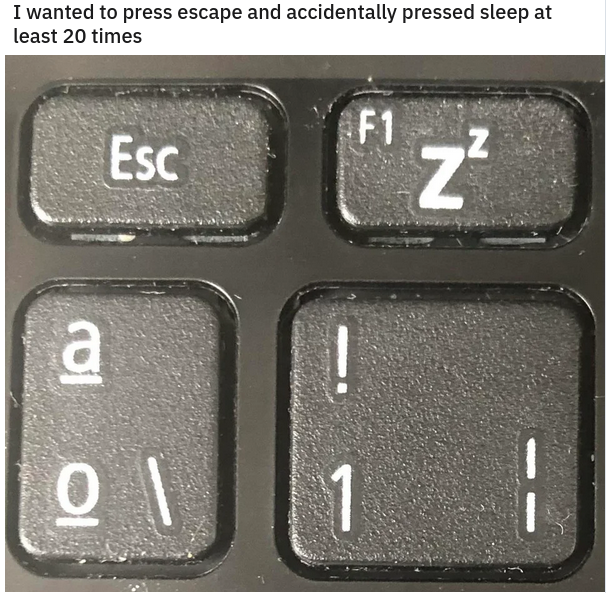
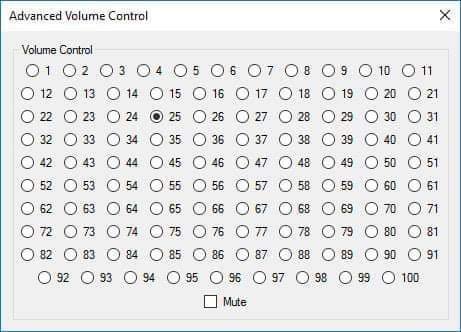

# Złe interfejsy wokół nas.

Często pomimo najlepszych starań i dobrych chęci nie udaje nam się zaprojektować czegoś dobrego czy użytecznego.

Przyczyn jest wiele: chęć zrobienia bezpiecznego urządzenia czy strony, chęć bycia oryginalnym, optymalizacji rozmiaru urządzenia, czy chociażby brak wiedzy jak zaprogramować coś w inny sposób.

Na [forum](https://www.reddit.com/r/BadDesigns/) poświęconemu złym projektom znalazłem kilka przykładów dobrze oddających powyższe przyczyny:

**1. Chęć zrobienia bezpiecznego urządzenia czy strony**

Aktualnie projektując strony internetowe, mające kwestionariusze lub innego typu pola przeznaczone na wpisanie danych przez użytkownika, trzeba bardzo uważać na ataki hakerskie. Uzywając pól tekstowych można zastosować atak "SQL injection", aby się przed nim zabezpieczyć pola tekstowe są teraz sprawdzane czy nie zawierają pewnych specjalnych znaków (np. średnik) albo czy zawierają odpowiedni typ danych (np. w polu 'Wiek' mogą być tylko liczby). Czasami, jak widać na zamieszczonym obrazku, zabezpieczenia są źle dobrane co prowadzi do problemów.

Rozwiązanie: poprawienie zabezpieczeń, aby to polę przyjmowało tylko liczbę naturalną.

**2. Chęć bycia oryginalnym**

Jest to przykład zignorowania potrzeb użytkownika. Niestety tego typu produkty często są bezużyteczne, poza swoją wartością wizualną, ponieważ nie zostały zaprojektowane z myślą o ich używaniu.

Rozwiązanie: zmiana kształtu, albo dodanie warstwy przezroczystej żywicy, która pozwoliła by ujednolicić kształt kubka pozostawiając widoczny kształt.

**3. Optymalizacja rozmiaru urządzenia**

Chcąc stworzyć coraz mniejsze laptopy musimy też zmniejszać klawiatury, w tym celu niektóre przyciski muszą spełniać więcej niż jedną funkcję.
Pomijając już kwestię, że takie wielofunkcyjne przyciski są nieintuicyjne i stanowią nienajlepszy interfejs same w sobie, tutaj jest zupełnie inny problem. Obok przycisku ESC, który jest dosyć często używany w róznych aplikacjach, projektant ustawił przycisk uśpienia komputera, co powoduje że chcąc w pośpiechu nacisnąć klawisz ESC można przez przypadek uśpić swój komputer, marnując dużo czasu.

Rozwiązanie: projektując interfejs nie ustawiać często używanych funkcji obok wyłącznika urządzenia lub tego typu funkcji. Powinno się wydzielić oddzielną przestrzeń specjalnie dla wyłącznika i jemu podobnych z dala od często używanych przycisków.

**4. Brak wiedzy jak zaprogramować coś w inny sposób**

Od wielu lat zmiana głośnościu urządzenia jest wykonywana przy pomocy suwaka, jest to dobrze przetestowany interfejs, który stał się tak naprawdę standardem. Widzę tylko dwa możliwe powody, żeby nie skorzystać z takiego utartego interfejsu:
1. Wierzymy, że nasz interfejs jest lepszy i zastąpi ten używany do tej pory.
2. Nie wiemy jak w danym języko programowania czy danym środowisku stworzyć ustandaryzowany interfejs, więc radzimy sobie jak tylko potrafimy.

Rozwiązanie: poświęcenie więcej czasu na dokładne zapoznanie się z językiem programowania i środowiskiem, aby być w stanie zaprogramować coś co nie tylko działa, ale jest też dobrej jakości.